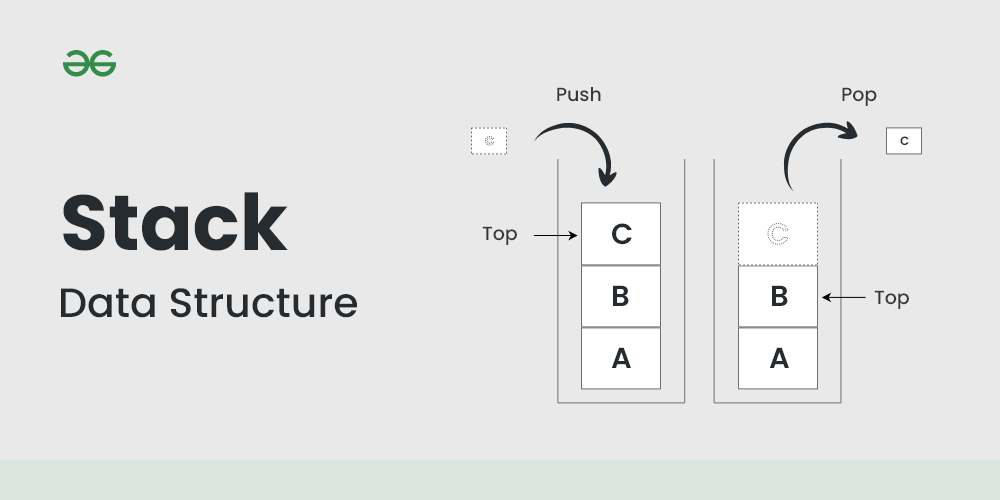
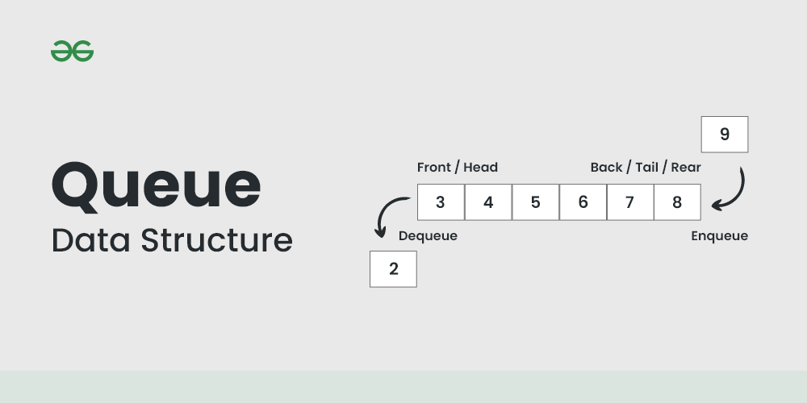

||문제|풀이|난이도|
|--|--|--|--|
|프로그래머스|[같은 숫자는 싫어](https://school.programmers.co.kr/learn/courses/30/lessons/12906)|[👉](./01_같은숫자는싫어.py)|⭐️★★|
|프로그래머스|[기능 개발](https://school.programmers.co.kr/learn/courses/30/lessons/42586)|[👉](./02_기능개발.py)|⭐️⭐️★|
|프로그래머스|[올바른 괄호](https://school.programmers.co.kr/learn/courses/30/lessons/12909)|[👉](./03_올바른괄호.py)|⭐️⭐️★|
|프로그래머스|[프로세스](https://school.programmers.co.kr/learn/courses/30/lessons/42587)|[👉](./04_프로세스.py)|⭐️⭐️★|
|프로그래머스|[다리를 지는 트럭](https://school.programmers.co.kr/learn/courses/30/lessons/42583)|[👉](./05_다리를지나는트럭.py)|⭐️⭐️★|


<br><br><br>
---
<br><br>

# 🔍 스택(Stack) & 큐(Queue)

## 📌 목차

1. [스택(Stack)](#1)
2. [스택 연산](#2)
3. [큐(Queue)](#3)
4. [큐 연산](#4)

## [📚 스택(Stack)](#1)
후입선출(LIFO, Last-In-First-Out) 구조를 가지는 자료구조


> 출처: https://www.geeksforgeeks.org/stack-data-structure/

|연산|설명|
|--|--|
|`push()`|스택에 데이터를 삽입|
|`pop()`|스택의 맨 위에 있는 데이터를 삭제|
|`peek()`|스택의 맨 위에 있는 데이터를 반환(제거 X)|
|`is_empty()`|스택이 비어있는지 확인|
|`size()`|스택의 크기를 반환|

## 📚 스택 연산
### 리스트 사용
```python
stack = []

# push - O(1)
stack.append(1) 
stack.append(2) 
stack.append(3) 

# pop - O(1)
print(stack.pop()) # 출력: 3
```

### deque 사용
```python
from collections import deque

stack = deque()

# push - O(1)
stack.append(1)
stack.append(2)
stack.append(3)

# pop - O(1)
print(stack.pop())  # 출력: 3
```

## [📚 큐(Queue)](#3)
선입선출(FIFO, First-In-First-Out) 구조를 가지는 자료구조


> 출처: https://www.geeksforgeeks.org/queue-data-structure/

|연산|설명|
|--|--|
|`enqueue()`|큐에 데이터를 삽입|
|`dequeue()`|큐의 맨 앞에 있는 데이터를 삭제|
|`peek()`|큐의 맨 앞에 있는 데이터를 반환(제거 X)|
|`is_empty()`|큐가 비어있는지 확인|
|`size()`|큐의 크기를 반환|

## [📚 큐 연산](#4)
### 리스트 사용
```python
queue = []

# enqueue O(1)
queue.append(1) 
queue.append(2) 
queue.append(3) 

# dequeue O(n)
print(queue.pop(0)) # 출력:1
```

```python
from collections import deque

queue = deque()

# enqueue O(1)
queue.append(1)
queue.append(2)
queue.append(3)

# dequeue O(1)
print(queue.popleft())  # 출력: 1
```

- `deque`는 이중 연결 리스트(Doubly Linked List)로 구현되어 있어 양쪽 끝에서 삽입 및 삭제 연산이 O(1)에 수행됨


<br><br><br>


## Reference
- [인프런 - 코딩테스트(ALL_IN_ONE)](https://www.inflearn.com/course/%EC%BD%94%EB%94%A9%ED%85%8C%EC%8A%A4%ED%8A%B8-%EC%9E%85%EB%AC%B8-%ED%8C%8C%EC%9D%B4%EC%8D%AC)
- [GeeksforGeeks - Stack Data Structure](https://www.geeksforgeeks.org/stack-data-structure/)