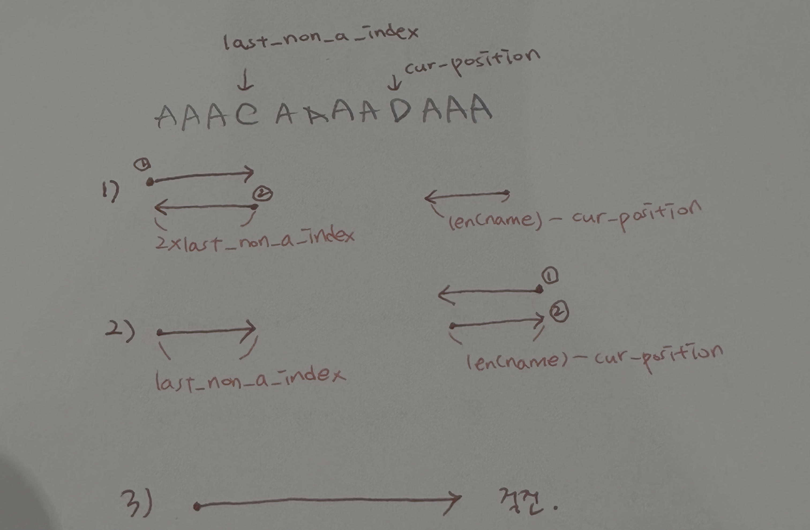
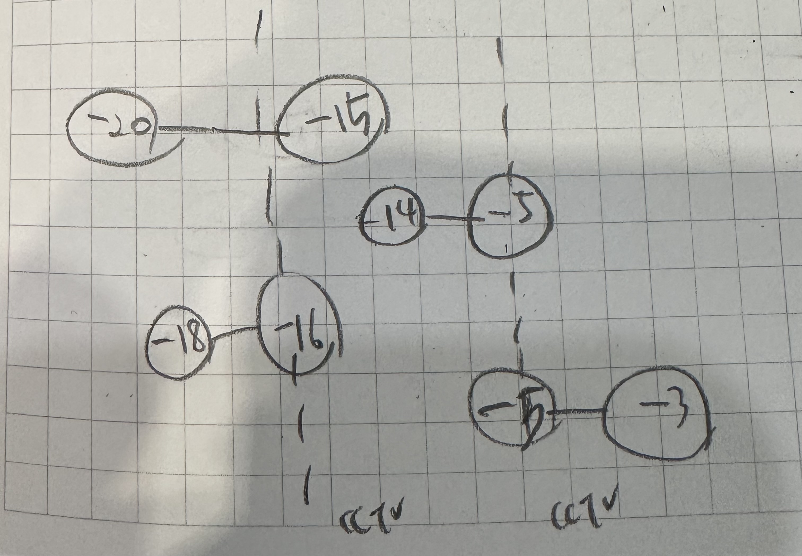

||문제|풀이|난이도|
|--|--|--|--|
|프로그래머스|[체육복](https://school.programmers.co.kr/learn/courses/30/lessons/42862)|[👉](./01_체육북.py)|⭐️★★|
|프로그래머스|[조이스틱](https://school.programmers.co.kr/learn/courses/30/lessons/42860)|[👉](./02_조이스틱.py)|⭐️⭐️★|
|프로그래머스|[큰 수 만들기](https://school.programmers.co.kr/learn/courses/30/lessons/42883)|[👉](./03_큰수만들기.py)|⭐️⭐️★|
|프로그래머스|[구명보트](https://school.programmers.co.kr/learn/courses/30/lessons/42885)|[👉](./04_구명보트.py)|⭐️⭐️★|
|프로그래머스|[섬 연결하기](https://school.programmers.co.kr/learn/courses/30/lessons/42861)|[👉](./05_섬연결하기.py)|⭐️⭐️⭐️|
|프로그래머스|[단속카메라](https://school.programmers.co.kr/learn/courses/30/lessons/42884)|[👉](./06_단속카메라.py)|⭐️⭐️⭐️|

<br><br><br>
---
<br><br>

# Greedy Algorithm

## 📌 개념
- Greedy 알고리즘(탐욕 알고리즘)은 문제를 해결하는 과정에서 현재 시점에서 가장 최선이라고 생각되는 선택을 하는 방식
- 이 접근법은 항상 **지역적으로 최적의 해를 선택하면서 전체 문제의 최적 해답을 찾고자 한다.**
- Greedy 알고리즘을 적용할 수 있는 문제는 지역적으로 최적이면서 전역적으로 최적인 문제들

## 🔑 특징
- **현재 최적의 선택**을 반복적으로 수행
- **최적 부분 구조(Optimal Substructure)** 와 **탐욕적 선택 속성(Greedy Choice Property)** 을 만족하는 문제에 적합
- **이전 단계의 결정을 고려하지 않음**
- 일반적으로 **빠른 실행 속도**를 보이며, 시간 복잡도는 $O(n)$ 또는 $O(nlog n)$ 수준인 경우가 많음

## ✅ 사용 조건
Greedy 알고리즘이 최적해를 보장하는 문제는 다음 조건을 만족해야 함:
1. **탐욕적 선택 속성(Greedy Choice Property)**: 각 단계에서 최적의 선택을 하면 전체 문제에 대해서도 최적의 해결책이 됨
2. **최적 부분 구조(Optimal Substructure)**: 부분 문제의 최적해를 이용하여 전체 문제의 최적해를 구할 수 있음

## 🎯 활용 사례
| 문제 유형 | 예제 |
|-----------|----------------------------------------------------|
| 최소 동전 개수 | 거스름돈 문제 |
| 최단 경로 | 다익스트라 알고리즘 |
| 최소 신장 트리 | 크루스칼 알고리즘, 프림 알고리즘 |
| 작업 스케줄링 | 회의실 배정 문제 |
| 배낭 문제 | Fractional Knapsack Problem (분할 가능 배낭 문제) |

## 📌 구현 예제
### 1. 거스름돈 문제
> 1. 탐욕적 선택 속성: 각 단계에서 가장 큰 동전을 최대한 사용하면서 최적의 선택을 함
> 2. 최적 부분 구조: 현재 가장 큰 단위를 먼저 선택하는 전략이 전체적으로 최적해를 보장

```python
# 가장 적은 개수의 동전으로 거스름돈을 돌려주는 문제

def min_coin_count(change, coins):
    coins.sort(reverse=True)  # 큰 단위의 동전부터 사용
    count = 0
    
    for coin in coins:
        count += change // coin
        change %= coin
    
    return count

# 예제 실행
coins = [500, 100, 50, 10]  # 사용 가능한 동전 단위
change = 1260
print(min_coin_count(change, coins))  # 출력: 6
```

### 2. 활동 선택 문제 (Activity Selection Problem)
> 1. 탐욕적 선택 속성: 종료 시간이 가장 빠른 활동을 선택 
> 2. 최적 부분 구조: 같은 방식으로 종료시간이 가장 빠른 활동을 선택하면 전체적으로 최적해를 보장


```python
# 활동 선택 문제: 회의실 배정 문제와 유사한 개념
# 서로 겹치지 않고 최대한 많은 활동을 선택하는 문제

def activity_selection(activities):
    activities.sort(key=lambda x: x[1])  # 종료 시간을 기준으로 정렬
    selected = []
    last_end_time = 0
    
    for start, end in activities:
        if start >= last_end_time:
            selected.append((start, end))
            last_end_time = end
    
    return selected

# 예제 실행
activities = [(1, 3), (2, 5), (3, 9), (6, 8), (5, 7)]
print(activity_selection(activities))  # 출력: [(1, 3), (5, 7)]
```

### 다익스트라 알고리즘

> 다익스트라 알고리즘: 가중치 그래프에서 시작점과 도착점이 주어졌을 때, 최소 비용을 return 하는 알고리즘

1. 시작 노드 선택
2. 시작 노드로부터 모든 노드까지의 거리를 무한대로 초기화
3. 시작 노드의 거리를 0으로 설정
4. 방문하지 않은 노드 중 가장 가까운 노드를 선택
5. 선택된 노드와 연결된 노드의 거리를 업데이트

```python
from heapq import heappop, heappush


def dijkstra(graph, start, end):
		distance = [float("inf")] * (vertex + 1)
		distance[start] = 0
    q = []
    heapq.heappush(q, (0, start))
    while q:
        dist, now = heapq.heappop(q)
        if distance[now] < dist:
            continue
        for vv, ww in graph[now]:
            cost = distance[now] + ww
            if cost < distance[vv]:
                distance[vv] = cost
                heapq.heappush(q, (cost, vv))
		return distance[end]
```

[참고](https://www.inflearn.com/course/%EC%BD%94%EB%94%A9%ED%85%8C%EC%8A%A4%ED%8A%B8-%EC%9E%85%EB%AC%B8-%ED%8C%8C%EC%9D%B4%EC%8D%AC)

## 🏆 장점과 단점
### ✅ 장점
- 구현이 간단하고 직관적
- 일반적으로 빠른 시간 내에 답을 구할 수 있음

### ❌ 단점
- 항상 최적해를 보장하지 않음
- Greedy 접근법이 실패하는 경우가 존재
- 최적 부분 구조 및 탐욕적 선택 속성을 만족하는 문제에만 적용 가능

---

## 02_조이스틱 설명


--- 
## 05_섬 연결하기

### 프림 알고리즘(Prim Algorithm)
`최소 비용 신장 트리(Minimum Spanning Tree)`를 찾는 알고리즘으로, **그리디 패러다임**을 기반으로 함

> MST: 그래프의 모든 정점을 연결하면서 사이클이 없고 간선의 가중치 합이 최소인 트리

> V: 정점 수, E: 간선 수 <br>
> 힙을 사용한 구현: O(E log V) <br>

> 프림은 하나의 트리를 유지하며 확장하고, 현재 트리에 포함되지 않은 정점만 추가하도록 설계되어있어, 별도의 사이클 확인 과정 없이도 사이클 발생을 방지

```python
import heapq

def prim(graph, start):
    """
    graph: 인접 리스트 형태로 표현된 그래프 {노드: [(가중치, 연결노드)]}
    start: 시작 노드
    """
    mst = []  # 최소 신장 트리를 저장할 리스트
    visited = set()  # 방문한 노드를 기록
    min_heap = [(0, start)]  # (가중치, 노드) 형태로 저장하는 최소 힙

    while min_heap:
        weight, node = heapq.heappop(min_heap) 
        
        if node not in visited:
            visited.add(node)
            mst.append((weight, node))
            
            for edge_weight, adjacent in graph[node]: 
                if adjacent not in visited:
                    heapq.heappush(min_heap, (edge_weight, adjacent))
    return mst

# 예제 그래프 (인접 리스트)
graph = {
    0: [(1, 1), (4, 2)],
    1: [(1, 0), (2, 2), (6, 3)],
    2: [(4, 0), (2, 1), (3, 3)],
    3: [(6, 1), (3, 2)]
}

# 시작 노드가 0일 때 프림 알고리즘 실행
result = prim(graph, start=0)
print("최소 신장 트리:", result)
```

### 크루스칼 알고리즘(Kruskal Algorithm)
`최소 비용 신장 트리(Minimum Spanning Tree)`를 찾는 알고리즘으로, **그리디 패러다임**을 기반으로 함

> 간선 중심으로 동작하며, 간선을 정렬한 뒤 하나씩 선택하여 MST를 구성

> 알고리즘 원리 <br>
> 1. 간선 정렬: 모든 간선을 가중치 기준으로 오름차순 정렬
> 2. 최소 가중치 간선 선택
> 3. 사이클 여부 확인: 유니온-파인드 자료구조를 사용하여 확인
> 4. 종료 조건: MST는 총 V-1개의 간선을 가져야 하므로, V-1개의 간선이 선택되면 알고리즘을 종료

> V: 정점 수, E: 간선 수 <br>
> 시간복잡도: O(E log E) <br>

> 그래프 내의 간선이 많은 경우는 프림 알고리즘, 간선이 적은 경우는 크루스칼 알고리즘이 유리
> [참고](https://ongveloper.tistory.com/376)

> 프림은 항상 하나의 연결된 구조를 유지하며 확장하고, 크루스칼은 독립적인 집합을 병합하면서 진행한다는 점에서 차이가 있음

```python
# 유니온-파인드 자료구조
def find(parent, x):
    if parent[x] != x:
        parent[x] = find(parent, parent[x])  # 경로 압축
    return parent[x]

def union(parent, rank, a, b):
    root_a = find(parent, a)
    root_b = find(parent, b)

    if root_a != root_b:
        # 랭크 기반 병합
        if rank[root_a] > rank[root_b]:
            parent[root_b] = root_a
        elif rank[root_a] < rank[root_b]:
            parent[root_a] = root_b
        else:
            parent[root_b] = root_a
            rank[root_a] += 1

# 크루스칼 알고리즘
def kruskal(edges, n):
    """
    edges: (가중치, 노드1, 노드2)의 리스트
    n: 그래프의 정점 수
    """
    edges.sort()  # 가중치 기준으로 정렬
    parent = [i for i in range(n)]  # 각 노드의 부모를 자기 자신으로 초기화
    rank = [0] * n  # 랭크 초기화

    mst = []  # 최소 신장 트리를 저장할 리스트
    mst_cost = 0

    for weight, u, v in edges:
        # 두 노드가 같은 집합에 속하지 않으면 (사이클 발생하지 않음)
        if find(parent, u) != find(parent, v):
            union(parent, rank, u, v)  # 두 집합 병합
            mst.append((u, v))  # MST에 추가
            mst_cost += weight

    return mst_cost, mst

# 예제 입력 (간선 리스트)
edges = [
    (1, 0, 1), (4, 0, 2), (3, 1, 2), (2, 1, 3),
    (5, 2, 3), (7, 3, 4), (6, 2, 4)
]
n = 5  # 정점 수

# 크루스칼 알고리즘 실행
cost, mst_edges = kruskal(edges, n)
print("최소 신장 트리 비용:", cost)
print("최소 신장 트리를 구성하는 간선들:", mst_edges)
```

--- 
## 06_단속카메라 설명



> A 차량 (-20, -15) <br>
> B 차량 (-14, -5) <br>
> C 차량 (-18, -16) <br>
> D 차량 (-5, -3)

- 이탈점으로 정렬
- 이탈점이 가장 빠른 차량(C)의 이탈점에는 무조건 카메라가 설치되어야 함. 
- 이전 설치된 cctv를 포함하지 않는 차량이 나타난다면, 이 차량의 이탈점으로 새로 cctv 설치

