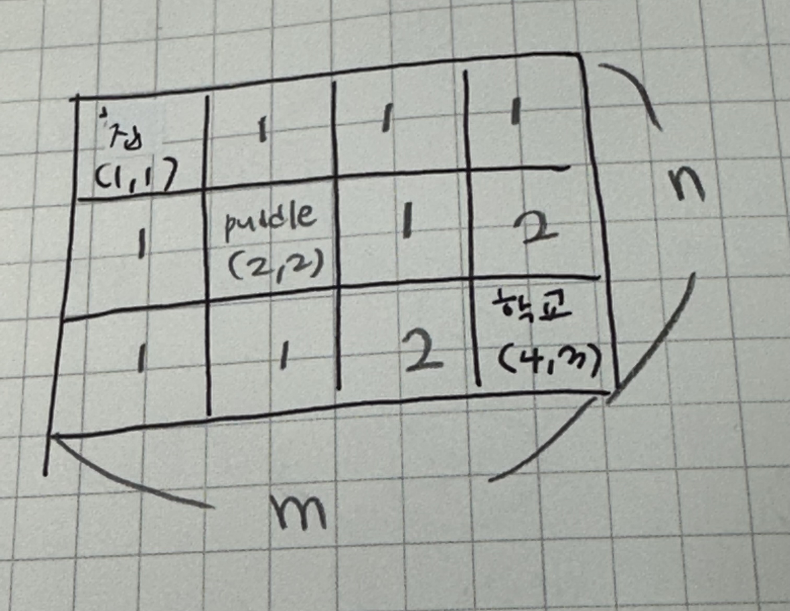

||문제|풀이|난이도|
|--|--|--|--|
|프로그래머스|[N으로 표현](https://school.programmers.co.kr/learn/courses/30/lessons/42895)|[👉](./01_N으로표현.py)|⭐️⭐️⭐️|
|프로그래머스|[정수삼각형](https://school.programmers.co.kr/learn/courses/30/lessons/43105)|[👉](./02_정수삼각형.py)|⭐️⭐️⭐️|
|프로그래머스|[등굣길](https://school.programmers.co.kr/learn/courses/30/lessons/42898)|[👉](./03_등굣길.py)|⭐️⭐️⭐️|

<br><br><br>
---
<br><br>

# Dynamic Programming

복잡한 문제들을 작은 하위 문제로 나누어 해결하고, 그 결과를 저장하여 동일한 하위 문제를 반복적으로 계산하지 않도록 하는 최적화 기법


## 📌 핵심 개념
1. 중복 계산 감소
    - 이미 계산한 결과를 저장하고, 필요할 때마다 재활용하여 중복된 계산을 피함
2. 최적 부분 구조
    - 큰 문제의 최적해는 작은 문제들의 최적해를 통해 구할 수 있어야 함
3. 점화식
    > 점화식: 주어진 문제의 해를 작은 문제의 해를 통해 표현하는 식
    - 큰 문제를 작은 문제들로 표현할 수 있어야 함


## 🔑 DP의 두 가지 구현 방식

- `memoization`
    - 하향식 접근 방식
    - 재귀적으로 문제를 해결하면서, 이미 계산한 결과를 저장하여 중복 계산을 피함
- `tabulation`
    - 상향식 접근 방식
    - 작은 문제부터 차례대로 해결해 나가면서, 그 결과를 저장하여 큰 문제를 해결함
- DP는 보통 두 가지 방식 중 하나로 구현되며, 문제에 따라 적합한 방식을 선택해야 함

### 1. Top-Down(재귀, memoization)

- n 부터 1로 접근

```python
memo = {}
def fib(n):
    if n<= 1:
        return n
    if n not in memo:
        memo[n] = fib(n-1, memo) + fib(n-2, memo)
    return memo[n]

n = 10
fib(n)
```

### 2. Bottom-Up(반복문, tabulation)

- 1 부터 n 까지 접근

```python
memo = {}
memo[0] = 0
memo[1] = 1

for i in range(3, n+1):
    memo[i] = memo[i-1] + memo[i-2]

print(memo[n])
```

[참고](https://www.inflearn.com/course/%EC%BD%94%EB%94%A9%ED%85%8C%EC%8A%A4%ED%8A%B8-%EC%9E%85%EB%AC%B8-%ED%8C%8C%EC%9D%B4%EC%8D%AC)

---

## 03_등굣길 



```plain
count_paths(3, 4)
├─ count_paths(2, 4)
│  ├─ count_paths(1, 4)
│  │  ├─ count_paths(1, 3)
│  │  │  ├─ count_paths(1, 2)
│  │  │  │  ├─ count_paths(1, 1) → 1
│  │  │  │  └─ count_paths(0, 2) → 범위 밖
│  │  │  └─ count_paths(0, 3) → 범위 밖
│  │  └─ count_paths(0, 4) → 범위 밖
│  └─ count_paths(2, 3)
│     ├─ count_paths(2, 2) → 웅덩이! skip
│     └─ count_paths(1, 3) (이미 호출됨 → memo 재사용)
├─ count_paths(3, 3)
│  ├─ count_paths(2, 3) (이미 호출됨 → memo 재사용)
│  └─ count_paths(3, 2)
│     ├─ count_paths(2, 2) → 웅덩이! skip
│     └─ count_paths(3, 1)
│        ├─ count_paths(2, 1)
│        │  ├─ count_paths(1, 1) → 1
│        │  └─ count_paths(2, 0) → 범위 밖
│        └─ count_paths(3, 0) → 범위 밖
```