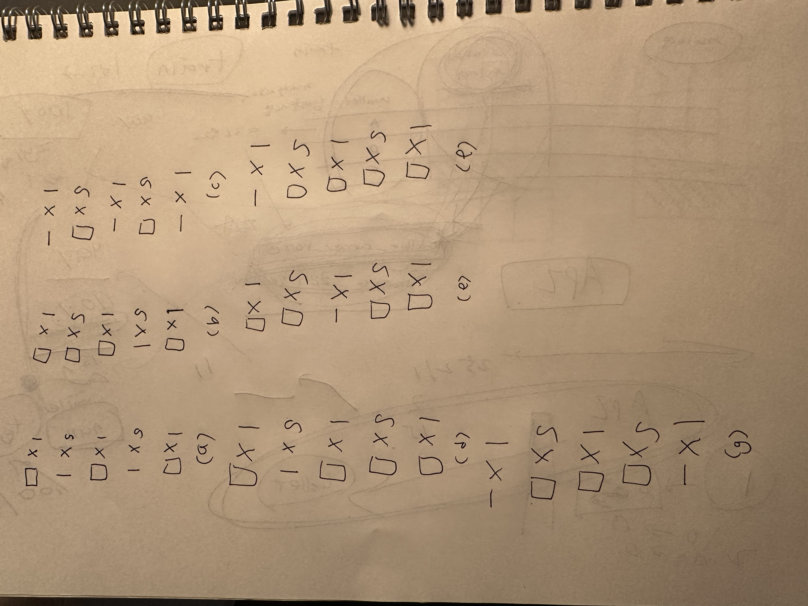
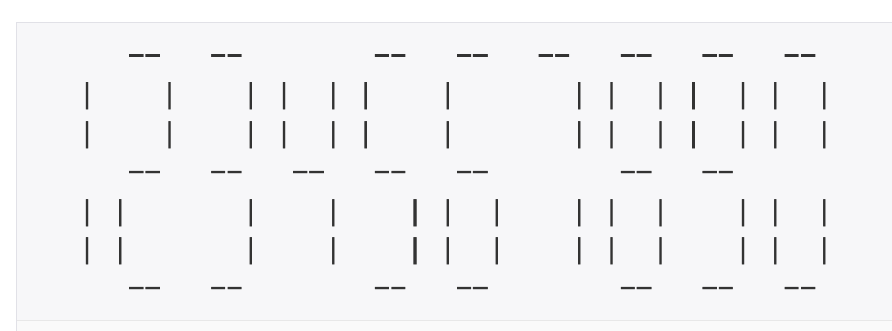
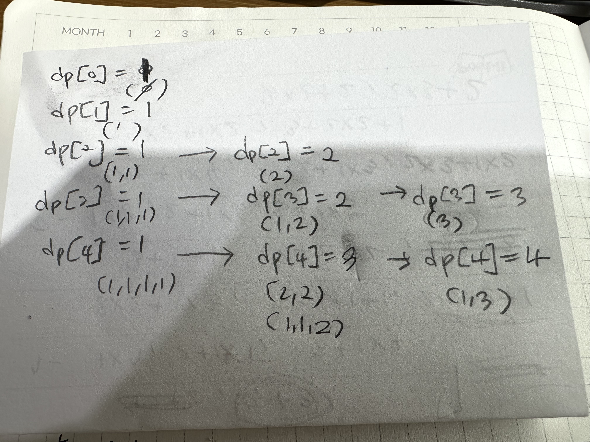

|문제|풀이|난이도|푼 방식|
|--|--|--|----|
|[사탕 게임](https://www.acmicpc.net/problem/3085)|[👉](./01_사탕게임.py)|🩶 x 2|완전 탐색|
|[리모컨](https://www.acmicpc.net/problem/1107)|[👉](./02_리모컨.py)|💛 x 4|완전 탐색, 중복 순열|
|[수 이어 쓰기 1](https://www.acmicpc.net/problem/1748)|[👉](./03_수이어쓰기1.py)|🩶 x 4|수학, 구현|
|[카잉 달력](https://www.acmicpc.net/problem/6064)|[👉](./04_카잉달력.py)|🩶 x 1|수학|
|[테트로미노](https://www.acmicpc.net/problem/14500)|[👉](./05_테트로미노.py)|💛 x 4|구현|
|[연산자 끼워넣기](https://www.acmicpc.net/problem/14888)|[👉](./06_연산자_끼워넣기.py)|🩶 x 1|재귀, 완전 탐색|
|[괄호의 값](https://www.acmicpc.net/problem/2504)|[👉](./07_괄호의값.py)|💛 x 5|스택|
|[빗물](https://www.acmicpc.net/problem/14719)|[👉](./08_빗물.py)|💛 x 5|구현|
|[가르침](https://www.acmicpc.net/problem/1062)|[👉](./09_가르침.py)|💛 x 4|완전 탐색, 비트마스크|
|[멀티탭 스케줄링](https://www.acmicpc.net/problem/1700)|[👉](./10_멀티탭스케줄링.py)|💛 x 1|그리디|
|[부분합](https://www.acmicpc.net/problem/1806)|[👉](./11_부분합.py)|💛 x 4|큐|
|[최소비용 구하기](https://www.acmicpc.net/problem/1916)|[👉](./12_최소비용구하기-다익스트라.py)|💛 x 5|다익스트라, 벨만포드|
|[부분 문자열](https://www.acmicpc.net/problem/16916)|[👉](./13_부분문자열.py)|🤎 x 1|문자열 in|
|[줄 세우기](https://www.acmicpc.net/problem/2252)|[👉](./14_줄세우기.py)|💛 x 3|위상정렬|
|[iSharp](https://www.acmicpc.net/problem/3568)|[👉](./15_isharp.py)|🩶 x 3|스택, 구현|
|[신기한 소수](https://www.acmicpc.net/problem/2023)|[👉](./16_신기한소수.py)|💛 x 5|dfs|
|[CPU](https://www.acmicpc.net/problem/16506)|[👉](./17_CPU.py)|🩶 x 5|구현|
|[LCD Test](https://www.acmicpc.net/problem/2290)|[👉](./18_LCDTest.py)|🩶 x 2|구현|
|[두 동전](https://www.acmicpc.net/problem/16197)|[👉](./19_두동전.py)|💛 x 4|bfs|
|[Puyo Puyo](https://www.acmicpc.net/problem/11559)|[👉](./20_puyopuyo.py)|💛 x 5|bfs/dfs, 시뮬레이션(중력 구현)|
|[Strahler 순서](https://www.acmicpc.net/problem/9470)|[👉](./21_strahler_순서.py)|💛 x 3|위상정렬|
|[미네랄](https://www.acmicpc.net/problem/2933)|[👉](./22_미네랄.py)|💛 x 3|bfs, 시뮬레이션|
|[사회망 서비스(SNS)](https://www.acmicpc.net/problem/2533)|[👉](./23_sns.py)|💛 x 3|dfs|
|[합리적인 이동경로](https://www.acmicpc.net/problem/2176)|[👉](./24_합리적인_이동경로.py)|💛 x 2|다익스트라, dfs, memoization(top-down)|
|[점프](https://www.acmicpc.net/problem/1890)|[👉](./25_점프.py)|🩶 x 1|dp, memoization(top-down)|
|[기타리스트](https://www.acmicpc.net/problem/1495)|[👉](./26_기타리스트.py)|🩶 x 1|dp, bottom-up|
|[BOJ 거리](https://www.acmicpc.net/problem/12026)|[👉](./27_boj거리.py)|🩶 x 1|dp|
|[퇴사 2](https://www.acmicpc.net/problem/15486)|[👉](./28_퇴사2.py)|💛 x 5|dp|
|[1, 2, 3 더하기 4](https://www.acmicpc.net/problem/15989)|[👉](./29_123더하기4.py)|💛 x 5|dp, 점화식, 완전탐색 -> 이전 값을 재사용|
|[동전 2](https://www.acmicpc.net/problem/2294)|[👉](./30_동전2.py)|💛 x 5|dp, 완전탐색 -> 이전 값을 재사용|


<br><br><br>

--- 

# 가르침 문제 - 비트 마스크
- 집합을 효율적으로 다룰 수 있음(특히 부분집합 확인 문제)
- set의 in 연산, add, remove는 O(1)이지만, 차집합, 합집합, 교집합은 두 set 크기에 비례하는 O(len) 시간이 걸림

```python
mask = sum(1 << (ord(c) - ord('a')) for c in combo)
```
-> 알파벳 문자를 비트 마스크로 변환하는 코드
각 문자를 2진수 비트 위치로 매핑해 집합을 표현

1. ord(c) - ord('a') 
    -  문자 -> 비트 위치 계산
    - 예: c = 2(3번째 알파벳)
2. 비트 시프트 연산
- 1 << (위치)
    - 해당 위치에 1을 배치
    - 예: `c` -> `1 << 2` -> `4` (이진수 100)
3. 비트 합산
    - `sum()`으로 모든 문자에 대한 비트를 합침
    - 예: `combo= a, c` -> `1(0001) + 4(0100) = 5(0101)`


---

# LCDTest 문제






----

# 1, 2, 3 더하기 4 문제


1을 먼저 써야, 2를 쓸 수 있고, 2를 먼저 써야 3을 쓸 수 있음
-> 조합(중복 방지)