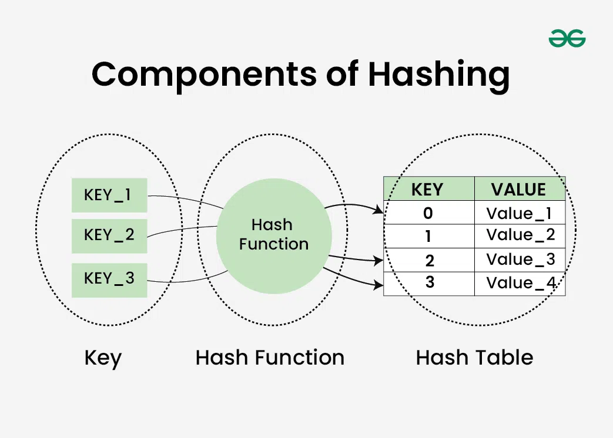

## 📌 1. 개념 및 정의

해시는 **키**와 **값**의 쌍을 저장하는 자료구조로, 일반적으로 **해시 테이블**을 통해 구현됩니다. 빠른 데이터 검색, 삽입, 삭제가 가능하며, **해시 함수**를 이용해 키를 특정한 인덱스로 변환하여 데이터를 저장합니다.

### 0. 구성 요소

1. 키(Key): 문자열이나 숫자로, 해시 함수의 입력값
2. 해시 함수(Hash Function): 키를 받아 해시 테이블의 특정 인덱스로 변환
3. 해시 테이블(Hash Table): 키에 해당하는 값을 저장하는 배열 구조



### 1. 해시 테이블(Hash Table)

해시 테이블은 배열과 해시 함수를 기반으로 구현됩니다. 키를 해시 함수를 통해 변환한 후, 특정한 **버킷(Bucket)** 또는 **슬롯**(**Slot**)에 저장하는 방식입니다.


### 2. 해시 함수(Hash Function)

해시 함수는 임의의 크기를 가진 키를 고정된 크기의 해시값으로 변환하는 함수입니다.

### 좋은 해시 함수의 조건:

- 균등한 분포: 해시 값이 고르게 분포되어야 함
- 빠른 연산 속도: O(1)에 가까운 속도로 해시값을 계산해야 함
- 충돌 최소화: 서로 다른 키들이 같은 해시 값을 갖지 않도록 해야 함

> 해시 함수 예:
> h(key) = key % table_size

## 🔍 2. 시간 및 공간 복잡도 분석

| 연산 | 평균 시간 복잡도 | 최악 시간 복잡도 |
| --- | --- | --- |
| 삽입 (Insert) | O(1) | O(n) (해시 충돌 심한 경우) |
| 삭제 (Delete) | O(1) | O(n) |
| 탐색 (Search) | O(1) | O(n) |
- **평균적으로 O(1)**: 해시 테이블을 사용하면 대부분의 연산이 O(1)로 처리 가능
- **최악의 경우 O(n)**: 해시 충돌이 많이 발생하면 성능 저하 가능

## ✅ 4. 코드 구현 및 최적화

### 🔹 Python 해시 테이블 구현 (딕셔너리 활용)

```python
# 기본 해시 테이블 (딕셔너리 활용)
hash_table = {}

# 삽입
hash_table['apple'] = 100
hash_table['banana'] = 200

# 탐색
print(hash_table.get('apple'))  # 출력: 100

# 삭제
del hash_table['apple']
```

### 🔹 직접 해시 테이블 구현 (체이닝 방식)

```python
class HashTable:
    def __init__(self, size):
        self.size = size
        self.table = [[] for _ in range(size)]

    def hash_function(self, key):
        return hash(key) % self.size

    def insert(self, key, value):
        index = self.hash_function(key)
        self.table[index].append((key, value))

    def get(self, key):
        index = self.hash_function(key)
        for k, v in self.table[index]:
            if k == key:
                return v
        return None  # Key not found

    def delete(self, key):
        index = self.hash_function(key)
        self.table[index] = [(k, v) for k, v in self.table[index] if k != key]

# 테스트 코드
ht = HashTable(10)
ht.insert("apple", 100)
ht.insert("banana", 200)
print(ht.get("apple"))  # 출력: 100
ht.delete("apple")
print(ht.get("apple"))  # 출력: None

```

## 🔥 5. 실전 문제 & 응용 사례

✅ **해시 알고리즘이 사용되는 분야**

- **데이터 검색 및 저장**: 데이터베이스 인덱싱, 캐싱 시스템
- **중복 검출**: 파일 무결성 검사, 이미지/음원 비교
- **보안 및 암호화**: 비밀번호 저장(SHA, MD5), 디지털 서명

✅ **추천 문제**

- 백준 17219번: 비밀번호 찾기 ([링크](https://www.acmicpc.net/problem/17219))
- LeetCode 1번: Two Sum ([링크](https://leetcode.com/problems/two-sum/))

## 📖 6. 요약 및 핵심 정리

| 개념 | 설명 |
| --- | --- |
| 해시 함수 | 데이터를 해시값으로 변환하는 함수 |
| 해시 테이블 | 해시값을 기반으로 데이터를 저장하는 자료구조 |
| 해시 충돌 | 같은 해시값을 가진 데이터가 여러 개 존재하는 현상 |
| 충돌 해결법 | 체이닝(Chaining), 오픈 어드레싱(Open Addressing) |
