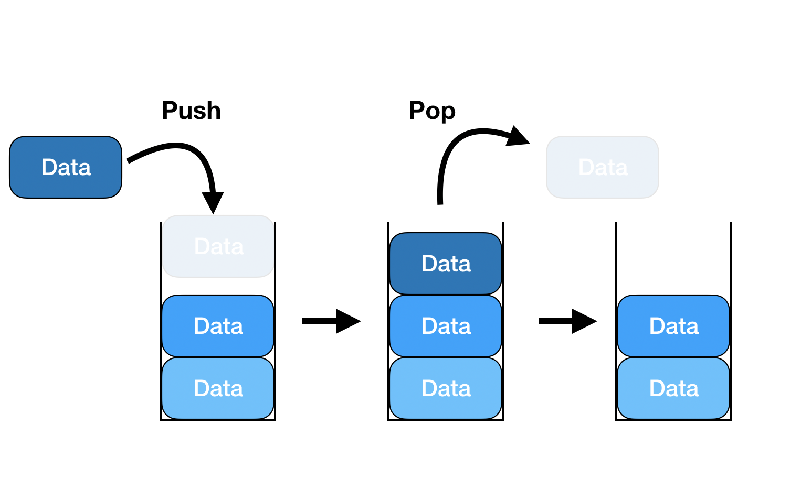
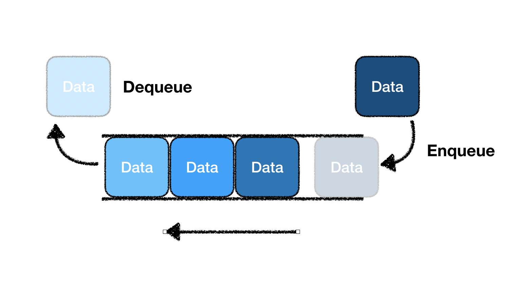

<!-- https://school.programmers.co.kr/learn/challenges?tab=algorithm_practice_kit -->
||문제|풀이|난이도|
|--|--|--|--|
|프로그래머스|[같은 숫자는 싫어](https://school.programmers.co.kr/learn/courses/30/lessons/1845)|[👉](./01_같은숫자는싫어.py)|⭐️★★|
|프로그래머스|[기능 개발](https://school.programmers.co.kr/learn/courses/30/lessons/42586)|[👉](./02_기능개발.py)|⭐️⭐️★|
|프로그래머스|[올바른 괄호](https://school.programmers.co.kr/learn/courses/30/lessons/12909)|[👉](./03_올바른괄호.py)|⭐️⭐️★|
|프로그래머스|[프로세스](https://school.programmers.co.kr/learn/courses/30/lessons/42587)|[👉](./04_프로세스.py)|⭐️⭐️★|
|프로그래머스|[다리를 지나는 트럭](https://school.programmers.co.kr/learn/courses/30/lessons/42583)|[👉](./05_다리를지나는트럭.py)|⭐️⭐️★|

## 📌 1. 개념 및 정의

스택(Stack)과 큐(Queue)는 선형 자료구조로, 데이터를 저장하고 삭제하는 방식에 차이가 있습니다.

### 0. 구성 요소

#### 🔹 스택(Stack)
1. **LIFO (Last In, First Out)**: 마지막에 삽입된 요소가 가장 먼저 삭제됨
2. **주요 연산**:
   - **push()**: 데이터를 스택에 삽입
   - **pop()**: 스택에서 최상단 요소를 제거 및 반환
   - **peek()** / **top()**: 최상단 요소를 확인 (제거하지 않음)

<figure>   
    
    <figcaption>https://coding-factory.tistory.com/602</figcaption>
</figure>


#### 🔹 큐(Queue)
1. **FIFO (First In, First Out)**: 먼저 삽입된 요소가 가장 먼저 삭제됨
2. **주요 연산**:
   - **enqueue()**: 데이터를 큐에 삽입
   - **dequeue()**: 큐에서 첫 번째 요소를 제거 및 반환
   - **front()**: 첫 번째 요소를 확인 (제거하지 않음)

<figure>   
    
    <figcaption>https://coding-factory.tistory.com/602</figcaption>
</figure>

## 🔍 2. 시간 및 공간 복잡도 분석

| 연산 | 스택 평균 시간 복잡도 | 큐 평균 시간 복잡도 |
| --- | --- | --- |
| 삽입 (push/enqueue) | O(1) | O(1) |
| 삭제 (pop/dequeue) | O(1) | O(1) |
| 조회 (peek/front) | O(1) | O(1) |

- **배열 기반 스택/큐**: 고정된 크기를 가지며, 크기 초과 시 재할당이 필요
- **연결 리스트 기반 스택/큐**: 동적으로 크기가 조정되며, 메모리 관리가 유연함

## ✅ 3. 코드 구현 및 최적화

### 🔹 스택 (Python 리스트 활용)
```python
class Stack:
    def __init__(self):
        self.stack = []

    def push(self, item):
        self.stack.append(item)

    def pop(self):
        return self.stack.pop() if self.stack else None

    def peek(self):
        return self.stack[-1] if self.stack else None

    def is_empty(self):
        return len(self.stack) == 0

# 테스트 코드
s = Stack()
s.push(1)
s.push(2)
print(s.pop())  # 출력: 2
```

### 🔹 큐 (collections.deque 활용)
```python
from collections import deque

class Queue:
    def __init__(self):
        self.queue = deque()

    def enqueue(self, item):
        self.queue.append(item)

    def dequeue(self):
        return self.queue.popleft() if self.queue else None

    def front(self):
        return self.queue[0] if self.queue else None

    def is_empty(self):
        return len(self.queue) == 0

# 테스트 코드
q = Queue()
q.enqueue(1)
q.enqueue(2)
print(q.dequeue())  # 출력: 1
```

## 🔥 4. 실전 문제 & 응용 사례

✅ **스택 & 큐가 사용되는 분야**

- **스택**:
  - 함수 호출 관리 (재귀 호출 스택)
  - 문자열 역순 처리
  - DFS(깊이 우선 탐색)
  
- **큐**:
  - 작업 스케줄링 (CPU 프로세스 관리)
  - BFS(너비 우선 탐색)
  - 캐시 구현 (LRU Cache)

✅ **추천 문제**
- 백준 10828번: 스택 ([링크](https://www.acmicpc.net/problem/10828))
- 백준 10845번: 큐 ([링크](https://www.acmicpc.net/problem/10845))
- LeetCode 20번: Valid Parentheses ([링크](https://leetcode.com/problems/valid-parentheses/))

## 📖 5. 요약 및 핵심 정리

| 개념 | 설명 |
| --- | --- |
| 스택(Stack) | LIFO(Last In, First Out) 방식으로 동작하는 자료구조 |
| 큐(Queue) | FIFO(First In, First Out) 방식으로 동작하는 자료구조 |
| 주요 연산 | 스택(push, pop, peek), 큐(enqueue, dequeue, front) |
| 활용 분야 | DFS, BFS, 연산자 우선순위 처리, 프로세스 스케줄링 등 |

