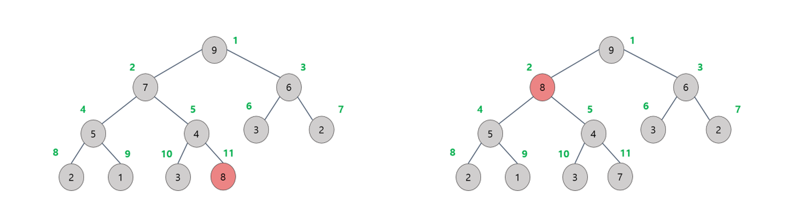
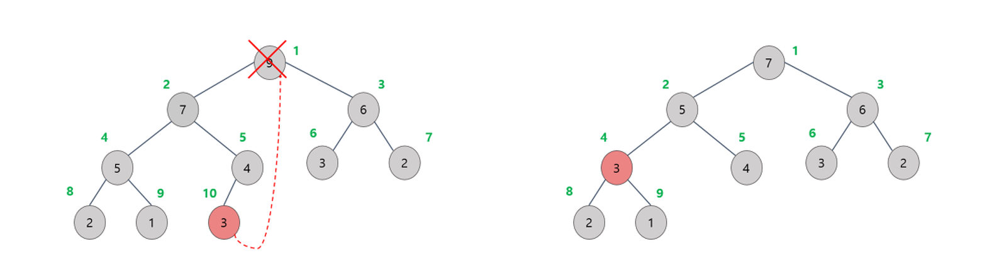
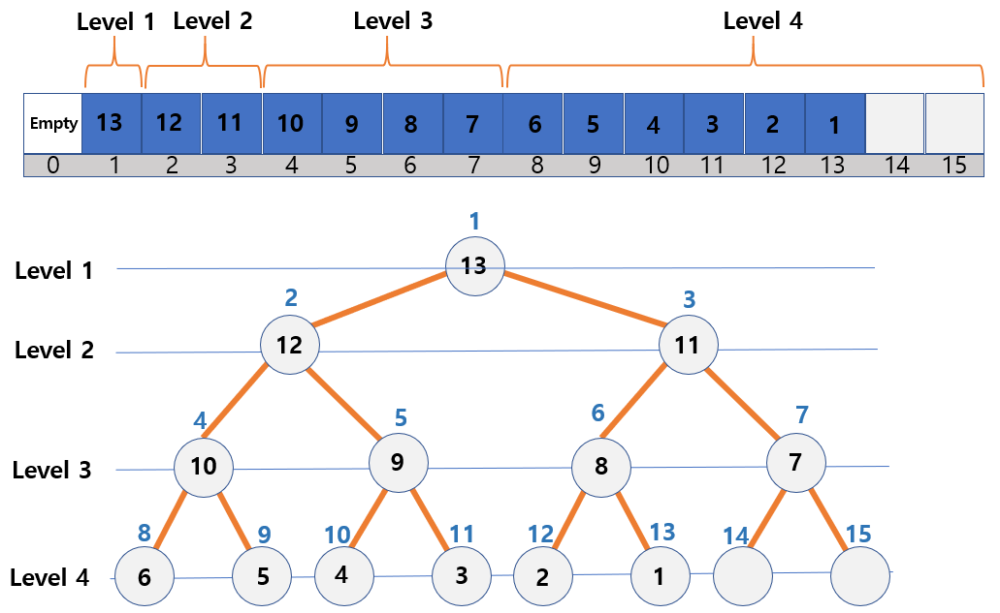

<!-- https://school.programmers.co.kr/learn/challenges?tab=algorithm_practice_kit -->
||문제|풀이|난이도|
|--|--|--|--|
|프로그래머스|[K번째수](https://school.programmers.co.kr/learn/courses/30/lessons/42626)|[👉](./01_K번째수.py)|⭐️⭐️★|
|프로그래머스|[디스크 컨트롤러](https://school.programmers.co.kr/learn/courses/30/lessons/42627)|[👉](./02_디스크컨트롤러.py)|⭐️⭐️⭐️|
|프로그래머스|[이중우선순위큐](https://school.programmers.co.kr/learn/courses/30/lessons/42628)|[👉](./03_이중우선순위큐.py)|⭐️⭐️⭐️|

## 📌 1. 개념 및 정의

### 0. 구성 요소

### 🔹 힙(Heap)이란?

- **완전 이진 트리(Complete Binary Tree)** 형태를 기반으로 하는 자료구조입니다.
- **부모 노드**와 **자식 노드** 사이에는 항상 대소 관계가 성립합니다.
    - **최대 힙**: 부모 노드의 키 값 ≥ 자식 노드의 키 값
    - **최소 힙**: 부모 노드의 키 값 ≤ 자식 노드의 키 값
- 루트 노드만 확인해도 최대(또는 최소) 값을 빠르게 알 수 있으므로, **우선순위 큐(Priority Queue) 구현**에 자주 사용됩니다.

#### 삽입 연산

1. 노드 8을 힙에 삽입했을 때, 힙의 마지막 인덱스에 추가합니다.
2. 최대 힙의 성질(부모노드는 항상 자식노드보다 크거나 같아야 한다)을 만족하기 위해, 부모 노드와 swap 됩니다.
#### 삭제 연산

1. 노드 9 삭제 시, 삭제 후 해당 자리에 힙의 마지막 노드로 대체합니다.
2. 최대 힙의 성질(부모노드는 항상 자식노드보다 크거나 같아야 한다)을 만족하기 위해, 둘 중 값이 큰 자식 노드와 swap 됩니다. 
이유는 부모 노드의 값이 자식 노드보다 항상 크거나 같아야 하는 최대 힙(Max Heap)의 성질을 유지하기 위해서입니다.

### 힙 배열의 위치 인덱스, 구조


- 루트 노드의 위치 인덱스의 값은 1
- 노드 i 의 부모 노드 인덱스 = [i / 2] , i>1 일때
    - ex) [5 / 2] = [2.5] = 2
- 노드 i 의 왼쪽 자식 노드 인덱스 = 2 * i
- 노드 i의 오른쪽 자식 노드 인덱스 = (2 * i) + 1

## 🔍 2. 시간 및 공간 복잡도 분석

| 연산 | 최소/최대 힙 평균 시간 복잡도 |
| --- | --- |
| **삽입** | O(log n) |
| **삭제** | O(log n) |
| **조회 (루트값)** | O(1) |
- **힙의 높이**는 완전 이진 트리 구조로 인해 최대 log n이 됩니다.
- 따라서 **삽입, 삭제 연산** 모두 힙의 높이에 해당하는 O(log n) 시간이 소요됩니다.

## ✅ 3. 코드 구현 및 최적화

### 🔹 파이썬의 `heapq` 모듈 (최소 힙)

```python
import heapq

# 최소 힙 사용 예시
min_heap = []
heapq.heappush(min_heap, 4)
heapq.heappush(min_heap, 1)
heapq.heappush(min_heap, 7)
print(min_heap)  # [1, 4, 7] -> 루트는 가장 작은 값

# 최솟값 추출
min_value = heapq.heappop(min_heap)
print(min_value)  # 1

```

### 🔹 최대 힙 구현(파이썬에서의 응용)

- 파이썬은 최대 힙을 제공하지 않으므로, **음수 값을 활용**하여 최대 힙을 흉내낼 수 있습니다.

```python
import heapq

max_heap = []
heapq.heappush(max_heap, -4)  # -4 삽입
heapq.heappush(max_heap, -1)  # -1 삽입
heapq.heappush(max_heap, -7)  # -7 삽입
print(max_heap)  # [-7, -1, -4] -> 실제 루트는 -7 (즉, 원본 데이터로는 7이 최대)

# 최댓값 추출
max_value = -heapq.heappop(max_heap)
print(max_value)  # 7

```

## 🔥 4. 실전 문제 & 응용 사례
✅ **힙이 사용되는 분야**

1. **우선순위 큐 구현**
    - CPU 스케줄링, 네트워크 트래픽 제어 등에서 가장 우선순위가 높은 작업(또는 가장 낮은 작업)을 빠르게 찾아 처리할 때 사용됩니다.
2. **최단 경로 탐색 (다익스트라 알고리즘)**
    - 가중치가 있는 그래프에서 최단 경로를 구할 때, 방문하지 않은 정점 중에서 비용이 가장 낮은 정점을 효율적으로 선택하기 위해 힙이 활용됩니다.

✅ **추천 문제**
- 백준 1927번: 최소 힙([링크](https://www.acmicpc.net/problem/1927))
- 백준 11279번: 최대 힙([링크](https://www.acmicpc.net/problem/11279))
- 백준 11286번: 최대 힙([링크](https://www.acmicpc.net/problem/11286))

## 📖 5. 요약 및 핵심 정리

| 개념 | 설명 |
| --- | --- |
| **힙(Heap)** | 완전 이진 트리를 기반으로 부모 노드와 자식 노드 간의 대소 관계를 유지하는 자료구조 |
| **최대 힙 / 최소 힙** | 최대 힙(부모 ≥ 자식), 최소 힙(부모 ≤ 자식) |
| **우선순위 큐** | 가장 높은 우선순위를 가진 데이터를 먼저 꺼내는 자료구조; 힙으로 구현 시 O(log n)의 삽입/삭제 가능 |
| **시간 복잡도** | 삽입, 삭제: O(log n), 루트 조회: O(1) |
| **활용 분야** | 우선순위가 중요한 작업 스케줄링, 다익스트라 알고리즘, K번째 큰 수/작은 수 문제 등 |

힙의 내부 동작 원리를 이해해 두면, **삽입·삭제가 O(log n)**에 이루어진다는 점과 **루트 노드가 최대(또는 최소)값을 가진다는 점**을 잘 활용하여 다양한 알고리즘 문제를 효율적으로 해결할 수 있습니다.

---
참고자료: https://mattlee.tistory.com/48