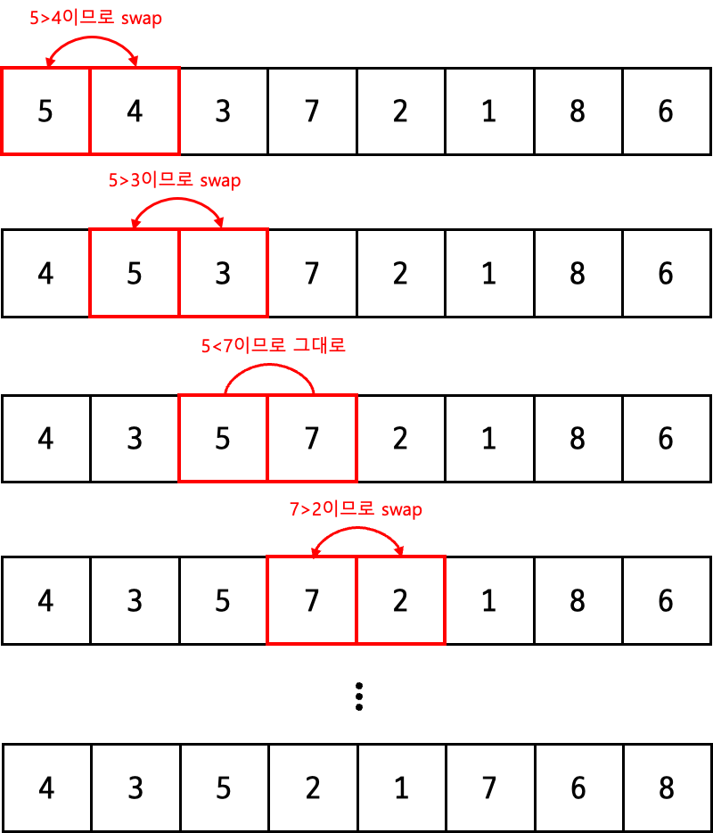
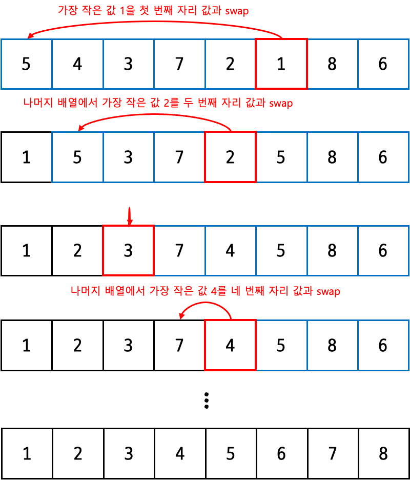
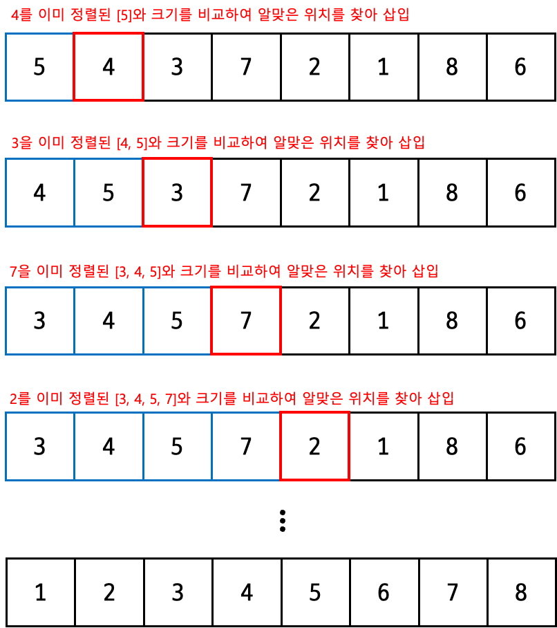
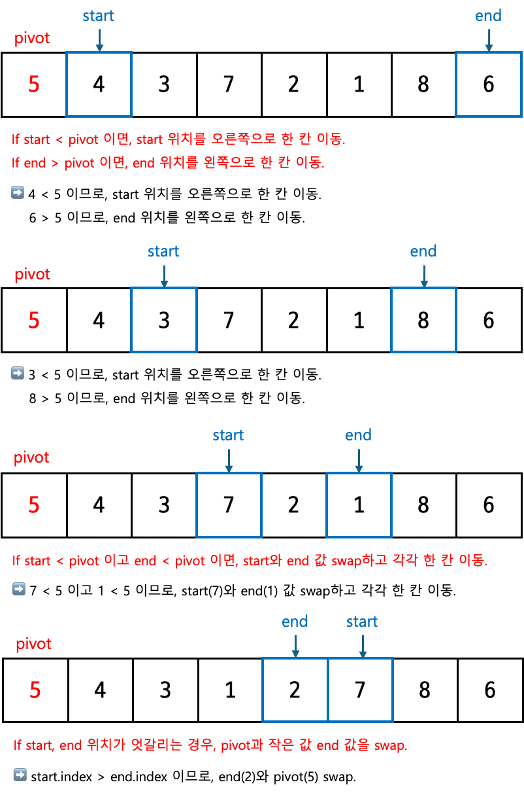
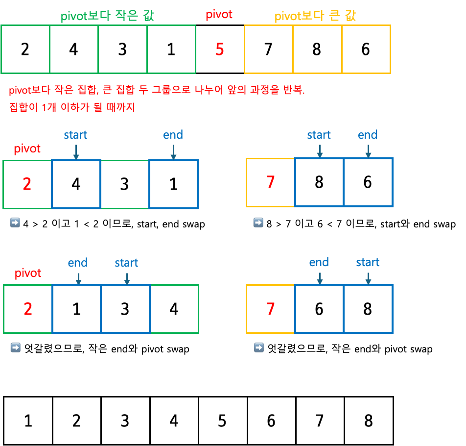
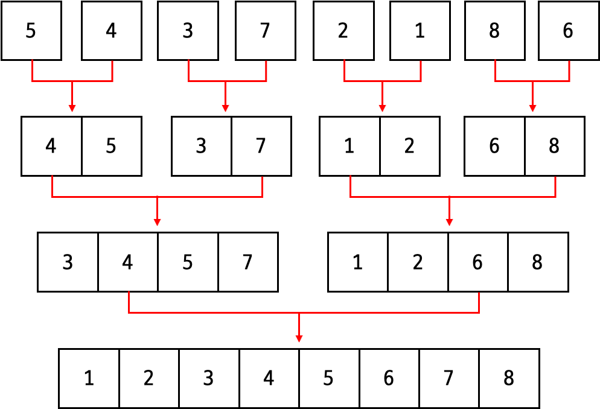

<!-- https://school.programmers.co.kr/learn/challenges?tab=algorithm_practice_kit -->
||문제|풀이|난이도|
|--|--|--|--|
|프로그래머스|[K번째수](https://school.programmers.co.kr/learn/courses/30/lessons/42748)|[👉](./01_K번째수.py)|⭐️★★|
|프로그래머스|[가장 큰 수](https://school.programmers.co.kr/learn/courses/30/lessons/42746)|[👉](./02_가장큰수.py)|⭐️⭐️★|
|프로그래머스|[H-Index](https://school.programmers.co.kr/learn/courses/30/lessons/42747)|[👉](./03_HIndex.py)|⭐️⭐️★|
|백준|[덩치](https://www.acmicpc.net/problem/7568)|[👉](./04_덩치.py)|🩶|
|백준|[합이 0](https://www.acmicpc.net/problem/3151)|[👉](./05_합이0.py)|💛|

## 📌 1. 개념 및 정의

### 🔹 정렬(Sorting)이란?
정렬은 데이터를 특정한 순서(오름차순 또는 내림차순)로 배치하는 알고리즘입니다.
정렬 방식에 따라 속도와 효율성이 달라지며, 대표적인 정렬 알고리즘으로 버블 정렬, 선택 정렬, 삽입 정렬, 퀵 정렬, 병합 정렬 등이 있습니다.

## 🔍 2. 주요 정렬 알고리즘
### **1. 버블 정렬 (Bubble Sort)**  
버블 정렬은 인접한 두 요소를 비교하여 큰 값을 뒤로 보내는 방식으로 정렬합니다.  

### **과정**  

1. 배열의 첫 번째 요소부터 인접한 두 요소를 비교합니다.  
2. 앞의 요소가 뒤의 요소보다 크면 위치를 교환(swap)합니다.  
3. 배열 끝까지 비교를 반복하면 가장 큰 값이 맨 끝에 정렬됩니다.  
4. 마지막 요소를 제외하고 위 과정을 반복합니다.  
5. 모든 요소가 정렬될 때까지 순회합니다.  


### **예제**
```python
arr = [4, 3, 5, 2, 1, 7, 6, 8]

for i in range(len(arr)):
    for j in range(len(arr) - i - 1):
        if arr[j] > arr[j + 1]:
            arr[j], arr[j + 1] = arr[j + 1], arr[j]
"""
첫 번째 순회 완료 후: [4, 3, 5, 2, 1, 7, 6, 8]  # 8이 제자리
두 번째 순회 완료 후: [3, 4, 2, 1, 5, 6, 7, 8]
"""
```

---

### **2. 선택 정렬 (Selection Sort)**  
선택 정렬은 배열에서 가장 작은 요소를 선택해 앞쪽으로 이동시키는 방식입니다.  

### **과정**  

1. 배열에서 최솟값을 찾습니다.  
2. 최솟값을 배열의 첫 번째 요소와 교환합니다.  
3. 그다음 요소부터 끝까지 반복하여 최솟값을 찾아 두 번째 요소와 교환합니다.  
4. 배열이 정렬될 때까지 반복합니다.  


### **예제**
```python
arr = [5, 4, 3, 7, 2, 1, 8, 6]

for i in range(len(arr)):
    min_idx = i
    for j in range(i + 1, len(arr)):
        if arr[j] < arr[min_idx]:
            min_idx = j
    arr[i], arr[min_idx] = arr[min_idx], arr[i]

"""
첫 번째 단계: [5, 4, 3, 7, 2, 1, 8, 6] → 1을 첫 번째 위치로 이동 → [1, 4, 3, 7, 2, 5, 8, 6]
두 번째 단계: 나머지 배열 [4, 3, 7, 2, 5, 8, 6] → 2를 두 번째 위치로 이동 → [1, 2, 3, 7, 4, 5, 8, 6]
"""
```
---

## **3. 삽입 정렬 (Insertion Sort)**  
삽입 정렬은 배열을 두 부분으로 나누고, 정렬되지 않은 요소를 하나씩 정렬된 부분에 삽입하는 방식입니다.  

### **과정**  

1. 배열의 첫 번째 요소는 이미 정렬되었다고 가정합니다.  
2. 두 번째 요소부터 시작하여 앞쪽의 정렬된 부분과 비교합니다.  
3. 적절한 위치를 찾아 삽입합니다.  
4. 배열의 끝까지 이 과정을 반복합니다.  


### **예제**
```python
arr = [5, 4, 3, 7, 2, 1, 8, 6]

for i in range(1, len(arr)):
    key = arr[i]
    j = i - 1
    while j >= 0 and arr[j] > key:
        arr[j + 1] = arr[j]
        j -= 1
    arr[j + 1] = key

"""
초기 배열: [5, 4, 3, 7, 2, 1, 8, 6]
첫 번째 삽입: 4를 5 앞에 삽입 → [4, 5, 3, 7, 2, 1, 8, 6]
두 번째 삽입: 3을 4 앞에 삽입 → [3, 4, 5, 7, 2, 1, 8, 6]
네 번째 삽입: 7은 제자리 유지
"""
```
---

## **4. 퀵 정렬 (Quick Sort)**  
퀵 정렬은 **피벗(pivot)** 을 기준으로 데이터를 작은 값과 큰 값으로 나누어 정렬하는 **분할 정복 알고리즘** 입니다.  

### **과정**  

1. 피벗을 선택합니다 (보통 첫 번째/마지막/중간 요소).  
2. 피벗보다 작은 값은 왼쪽, 큰 값은 오른쪽으로 분할합니다.  
3. 분할된 배열에서 왼쪽과 오른쪽 부분 배열에 대해 재귀적으로 퀵 정렬을 수행합니다.  
4. 모든 요소가 정렬될 때까지 반복합니다.  



### **예제**
```python
def quick_sort(arr):
    if len(arr) <= 1:
        return arr
    pivot = arr[len(arr) // 2]
    left = [x for x in arr if x < pivot]
    middle = [x for x in arr if x == pivot]
    right = [x for x in arr if x > pivot]
    return quick_sort(left) + middle + quick_sort(right)

"""
초기 배열: [5, 4, 3, 7, 2, 1, 8, 6]
첫 번째 pivot(5) → [4, 3, 2, 1] | 5 | [7, 8, 6]
왼쪽 배열 정렬: [4, 3, 2, 1] → pivot 2 선택 → [1] | 2 | [3, 4]
오른쪽 배열 정렬: [7, 8, 6] → pivot 7 선택 → [6] | 7 | [8]
"""
```
---

## **5. 병합 정렬 (Merge Sort)**  
병합 정렬은 데이터를 절반으로 나누고, 가장 작은 단위까지 쪼갠 뒤 다시 병합하며 정렬하는 **분할 정복 알고리즘** 입니다.  

### **과정**  
1. 배열을 반으로 나눕니다.  
2. 각 부분 배열을 재귀적으로 병합 정렬합니다.  
3. 부분 배열이 하나의 요소만 남을 때까지 나눕니다.  
4. 정렬하면서 병합합니다.  



### **예제**
```python
def merge_sort(arr):
    if len(arr) <= 1:
        return arr
    mid = len(arr) // 2
    left = merge_sort(arr[:mid])
    right = merge_sort(arr[mid:])
    
    result = []
    while left and right:
        if left[0] < right[0]:
            result.append(left.pop(0))
        else:
            result.append(right.pop(0))
    result.extend(left or right)
    return result

"""
초기 배열: [5, 4, 3, 7, 2, 1, 8, 6]
1. 분할 단계: [5, 4, 3, 7] [2, 1, 8, 6] → [5, 4] [3, 7] [2, 1] [8, 6] → [5] [4] [3] [7] [2] [1] [8] [6]
2. 병합 단계:
   [5]와 [4]를 합쳐 [4, 5]
   [3]과 [7]을 합쳐 [3, 7]
   [2]와 [1]을 합쳐 [1, 2]
   [8]과 [6]을 합쳐 [6, 8]
   → [4, 5]와 [3, 7] → [3, 4, 5, 7]
   → [1, 2]와 [6, 8] → [1, 2, 6, 8]
   → 최종 병합 → [1, 2, 3, 4, 5, 6, 7, 8]
"""
```

---

## 🔥 4. 실전 문제 & 응용 사례

| 정렬 응용 유형 | 설명 | 대표 문제 |
|--------------|----------------|----------------|
| 정렬 + 이분 탐색 | 정렬 후 O(logn) 시간 복잡도로 특정 값 찾기 | [랜선 자르기](https://www.acmicpc.net/problem/1654), [나무 자르기](https://www.acmicpc.net/problem/2805) |
| 정렬 + 투 포인터 | O(n) 시간 복잡도로 특정 합 찾기 | [두 수의 합](https://www.acmicpc.net/problem/3273), [합이 0](https://www.acmicpc.net/problem/3151) |
| 정렬 + 그리디 | 정렬 후 최적의 선택 반복 | [회의실 배정](https://www.acmicpc.net/problem/1931), [ATM](https://www.acmicpc.net/problem/11399) |

    

## 📖 5. 요약 및 핵심 정리

| **종류** | **시간 복잡도** | **설명** |
|---------|--------------|---------|
| **버블 정렬 (Bubble Sort)** | O(n²) | 인접한 두 요소를 비교하여 크기가 순서에 맞지 않으면 swap을 수행하는 방식 |
| **선택 정렬 (Selection Sort)** | O(n²) | 전체 데이터 중 최솟값(또는 최댓값)을 찾아 앞에서부터 순서대로 정렬하는 방식 |
| **삽입 정렬 (Insertion Sort)** | O(n²) | 이미 정렬된 부분에서 새로운 데이터를 적절한 위치에 삽입하는 방식 |
| **퀵 정렬 (Quick Sort)** | 평균 O(nlogn), 최악 O(n²) | pivot을 기준으로 데이터를 작은 값과 큰 값으로 나누어 정렬하는 방식 (분할 정복) |
| **병합 정렬 (Merge Sort)** | O(nlogn) | 데이터를 가장 작은 단위까지 나눈 뒤, 병합하면서 정렬하는 방식 (분할 정복) |

---
