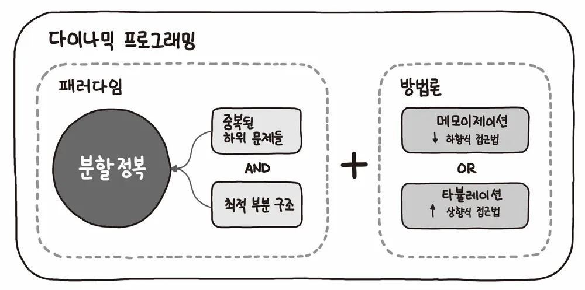
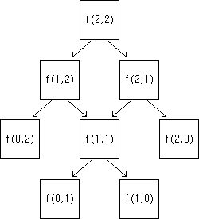

<!-- https://school.programmers.co.kr/learn/challenges?tab=algorithm_practice_kit -->
## 💡 동적 계획법 문제 목록

| 출처 | 문제 | 풀이 | 난이도 |
|--|--|--|--|
| 프로그래머스 | [N으로 표현](https://school.programmers.co.kr/learn/courses/30/lessons/42895) | [👉 코드 보기](./01_N으로표현.py) | ⭐️⭐️⭐️ |
| 프로그래머스 | [정수 삼각형](https://school.programmers.co.kr/learn/courses/30/lessons/43105) | [👉 코드 보기](./02_정수삼각형.py) | ⭐️⭐️⭐️ |
| 프로그래머스 | [등굣길](https://school.programmers.co.kr/learn/courses/30/lessons/42898) | [👉 코드 보기](./03_등굣길.py) | ⭐️⭐️⭐️ |
| 프로그래머스 | [사칙연산](https://school.programmers.co.kr/learn/courses/30/lessons/1843) | [👉 코드 보기](./04_사칙연산.py) | ⭐️⭐️⭐️⭐️ |
| 프로그래머스 | [도둑질](https://school.programmers.co.kr/learn/courses/30/lessons/42897) | [👉 코드 보기](./05_도둑질.py) | ⭐️⭐️⭐️⭐️ |

---

## 📌 1. 동적 계획법 (DP, Dynamic Programming)이란?

동적 계획법은 복잡한 문제를 작은 하위 문제로 나누고, 이들의 해를 저장하여 중복 계산을 피함으로써 효율적으로 해결하는 알고리즘 설계 기법입니다.

> 과거에 계산한 값을 재활용함으로써, 시간 복잡도를 크게 줄일 수 있습니다.

### ✅ 특징
- **최적 부분 구조(Optimal Substructure)**: 큰 문제의 최적해가 작은 문제의 최적해로 구성됨.
- **중복 부분 문제(Overlapping Subproblems)**: 동일한 작은 문제가 반복적으로 등장함.

- 핵심 아이디어: 한 번 계산한 값을 저장하여 다시 계산하지 않고 사용하는 **메모이제이션(Memoization)** 기법을 활용합니다.



## 2. 동작 예시 및 시각화



다음은 재귀적으로 정의된 문제 `f(a, b) = f(a-1, b) + f(a, b-1)`의 호출 트리입니다.

기저 조건:
- `f(0, n) = 1`, `f(n, 0) = 1`, `f(0, 0) = 1`

```
f(2,2)
├── f(1,2)
│   ├── f(0,2)
│   └── f(1,1)
│       ├── f(0,1)
│       └── f(1,0)
└── f(2,1)
    ├── f(1,1)  ← 이미 계산된 노드 (중복 호출)
    └── f(2,0)
```
- `f(1,1)`은 두 번 호출됨 → 중복되는 계산 발생.

하지만 메모이제이션을 활용하면 `f(1,1)`은 한 번만 계산하고 이후에는 재사용되므로,
최종적으로 5번의 연산만으로 `f(2,2)`를 계산할 수 있습니다.

> 중복되는 부분이 많아질 수록 속도의 차이는 기하급수적으로 증가한다.

---

## 3. 동적 계획법 구현 방식
동적 계획법은 계산한 결과를 저장하는 방식에 따라 두 가지로 나뉩니다:

각각의 방식을 피보나치 수열 문제에 대입하여 살펴보자.

### Top-down
- 위에서 내려오는 것, 즉 큰 문제부터 시작해서 작은 문제로 분할해 나가는 방식입니다.
- Python에서는 보통 재귀 호출과 딕셔너리/배열을 사용해 구현합니다.

```python
def fibonacc(n):
    if n <= 1: # 0,1번째 피보나치 수
        return n
    
    if memo[n] != 0: # 이미 계산된 값일 경우
        return memo[n]
    
    memo[n] = fibonacc(n-1) + fibonacci(n-2) # 작은 문제로 분할
    return memo[n]
```

### Botton-up
- 바닥에서 올라오는 것, 즉 작은 문제부터 시작해서 차례대로 큰 문제를 해결하는 방식입니다.
- 배열을 이용해 반복문으로 구현되며, 재귀 호출보다 메모리 및 속도 면에서 효율적일 수 있습니다.

```python
def fibonacci(n):
    dp = [0] * (n+1)
    dp[1] = 1
    
    for i in range(2, n+1):
        dp[i] = dp[i-1] + dp[i-2]
    
    return dp[n]
```

---

## 📊 4. 시간 및 공간 복잡도 분석

- 피보나치 수열 기준

| 방식 | 시간 복잡도 | 공간 복잡도 |
|------|-------------|-------------|
| 재귀 (순수) | O(2^n) | O(n) |
| Top-down DP | O(n) | O(n) |
| Bottom-up DP | O(n) | O(n) (또는 O(1)까지 가능) |

> 메모이제이션과 DP 테이블을 통해 **중복 연산을 제거**하여 시간 복잡도를 획기적으로 줄일 수 있습니다.

---

## 🧠 5. 핵심 요약

| 개념 | 설명 |
|------|------|
| 최적 부분 구조 | 전체 문제의 해가 부분 문제의 해로부터 구성될 수 있음 |
| 중복 부분 문제 | 동일한 하위 문제가 반복적으로 등장함 |
| 메모이제이션 | 계산 결과를 저장하여 동일한 연산을 반복하지 않음 |
| Top-down | 재귀 기반, 큰 문제 → 작은 문제 |
| Bottom-up | 반복문 기반, 작은 문제 → 큰 문제 |
| 시간 복잡도 | 일반적으로 O(n) 수준으로 최적화 가능 |

---