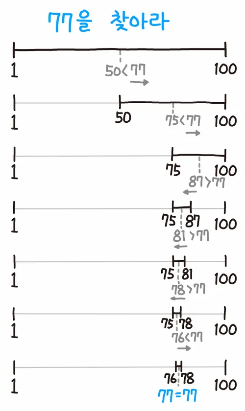

<!-- https://school.programmers.co.kr/learn/challenges?tab=algorithm_practice_kit -->
## 💡 DFS/BFS 문제 목록

| 출처 | 문제 | 풀이 | 난이도 |
|--|--|--|--|
| 프로그래머스 | [입국심사](https://school.programmers.co.kr/learn/courses/30/lessons/43238) | [👉 코드 보기](./01_입국심사.py) | ⭐️⭐️⭐️ |
| 프로그래머스 | [징검다리](https://school.programmers.co.kr/learn/courses/30/lessons/43236) | [👉 코드 보기](./02_징검다리.py) | ⭐️⭐️⭐️⭐️ |
---

## 📌 1. 이진 탐색 (Binary Search)이란?

이진 탐색은 **정렬된 리스트**에서 원하는 값을 빠르게 찾는 알고리즘입니다. </br>
탐색 범위를 절반씩 줄여 나가며, 비교 연산을 통해 찾고자 하는 값을 탐색합니다.

> 구현 방법: **반복문** 또는 **재귀함수**

### 주요 특징
- 반드시 정렬된 배열에서만 사용 가능
- 시간복잡도: O(log N)

## 2. 동작 방식 및 시각화

1. 배열의 중간값(mid)과 찾는 값(target)을 비교
2. 중간값이 target보다 크면 왼쪽 절반에서 다시 탐색
3. 중간값이 target보다 작으면 오른쪽 절반에서 다시 탐색
4. 위 과정을 값이 일치하거나, 범위가 소진될 때까지 반복

    

---

## 3. 이분탐색 구현 예시

### 비재귀적(반복문) 이진 탐색:

```python 
def binary_search(arr, target):
    first, last = 0, len(arr) - 1
    while first <= last:
        mid = (first + last) // 2
        if arr[mid] == target:
            return mid
        elif arr[mid] > target:
            last = mid - 1
        else:
            first = mid + 1
    return -1

```

### 재귀적 이진 탐색:

```python
def binary_search(arr, target, first, last):
    if first > last:
        return -1
    
    mid = (first + last) // 2
    if arr[mid] == target:
        return mid
    elif target < arr[mid]:
        return bSearch(arr, target, first, mid - 1)
    else:
        return bSearch(arr, target, mid + 1, last)
```

---
## 🧠 4. 핵심 요약 비교

| 항목 | 내용 |
|------|------|
| 적용 조건 | 배열이 정렬되어 있어야 함 |
| 시간 복잡도 | O(log N) |
| 구현 방식 | 반복문, 재귀 함수 |
| 장점 | 탐색 속도가 매우 빠름 (특히 데이터 양이 많을 때 유리) |
| 주의점 | 인덱스 관리 실수 주의, 무한 루프 또는 stack overflow 방지 필요 |
