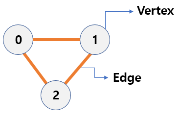

<!-- https://school.programmers.co.kr/learn/challenges?tab=algorithm_practice_kit -->
## 💡 그래프 문제 목록

| 출처 | 문제 | 풀이 | 난이도 |
|--|--|--|--|
| 프로그래머스 | [가장먼노드](https://school.programmers.co.kr/learn/courses/30/lessons/49189) | [👉 코드 보기](./01_가장먼노드.py) | ⭐️⭐️⭐️ |
| 프로그래머스 | [순위](https://school.programmers.co.kr/learn/courses/30/lessons/49191) | [👉 코드 보기](./02_순위.py) | ⭐️⭐️⭐️ |
| 백준 | [최소 스패닝 트리](https://www.acmicpc.net/problem/1197) | [👉 코드 보기](./03_최소스패닝트리.py) | 💛 |
| 백준 | [ACM Craft](https://www.acmicpc.net/problem/1005) | [👉 코드 보기](./04_ACMCraft.py) | 💛 |
| 프로그래머스 | [방의 개수](https://school.programmers.co.kr/learn/courses/30/lessons/49190) | [👉 코드 보기](./05_방의개수.py) | ⭐️⭐️⭐️⭐️⭐️ |
---

## 📌 1. 그래프 (Graph)란?

그래프(Graph)는 정점(Vertex)과 간선(Edge)으로 이루어진 자료구조로, 사물 간의 관계를 모델링하는 데 사용됩니다. </br>
예를 들어, 도로망, SNS 친구 관계, 웹 링크 구조 등이 그래프의 대표적인 사례입니다.
- 정점: 데이터를 나타내는 노드 (예: 도시, 사람, 페이지)
- 간선: 두 정점 간의 연결 (예: 도로, 친구 관계, 하이퍼링크)



> 구현 방법: **인접 행렬** 또는 **인접 리스트**


## 2. 그래프 구현 방법

### 인접 행렬 (Adjacency Matrix)
- 2차원 배열로 정점 간 연결 여부를 표현
- 모든 정점 간 연결 관계를 빠르게 확인 가능
- 공간복잡도: O(V²)

```python 
# 정점 0~2인 무방향 그래프
adj_matrix = [
    [0, 1, 1],
    [1, 0, 1],
    [1, 1, 0]
]
```

### 인접 리스트 (Adjacency List)
- 각 정점마다 연결된 정점 리스트를 저장
- 메모리 효율적이며 대부분의 경우 사용
- 공간복잡도: O(V + E)

```python
# 정점 0~2인 무방향 그래프
adj_list = {
    0: [1, 2],
    1: [0, 2],
    2: [0, 1]
}
```

---

## 3. ⭐ 주요 특징

| 분류            | 설명                                      |
|----------------|-------------------------------------------|
| 방향성         | 방향 그래프 (A → B) vs. 무방향 그래프 (A — B) |
| 가중치         | 가중치 그래프 (비용 있음) vs. 비가중치 그래프 |
| 연결성         | 연결 그래프 (모든 정점 연결됨) vs. 비연결 그래프 |
| 순환성         | 순환 그래프 vs. 비순환 그래프 (DAG)          |

## 4. ⚙️ 문제 유형

그래프 알고리즘은 보통 **탐색을 기반**으로 동작하며, 문제 유형에 따라 다양한 방식이 사용됩니다.

### ✅  그래프 탐색: DFS, BFS
### **DFS (Depth-First Search)**
- 개념: 한 방향으로 끝까지 파고든 다음, 더 이상 못 가면 백트래킹해서 다른 경로 탐색
- 구현: 재귀 or 스택 
- 언제 사용?
    - 모든 경로 탐색이 필요할 때 (예: 미로 탐색)
    - 백트래킹 기반 문제 (예: 퍼즐, 조합 등)
```python
def dfs(graph, start, visited=set()):
    visited.add(start)
    print(start, end=' ')
    for neighbor in graph[start]:
        if neighbor not in visited:
            dfs(graph, neighbor, visited)

# 예시 그래프
graph = {
    1: [2, 3],
    2: [4],
    3: [5],
    4: [],
    5: []
}
dfs(graph, 1)  # 출력: 1 2 4 3 5
```

### **BFS (Breadth-First Search)**
- 개념: 가까운 노드부터 탐색 (한 레벨씩 탐색)
- 구현: 큐 사용
- 언제 사용?
    - 최단 거리 탐색 (무가중치 그래프)
    - 레벨 기반 문제 

```python
from collections import deque

def bfs(graph, start):
    visited = set([start])
    queue = deque([start])
    while queue:
        node = queue.popleft()
        print(node, end=' ')
        for neighbor in graph[node]:
            if neighbor not in visited:
                visited.add(neighbor)
                queue.append(neighbor)

bfs(graph, 1)  # 출력: 1 2 3 4 5
```
---
### ✅  최단 경로 탐색
### **다익스트라 알고리즘**
- 개념: 우선순위 큐로 가장 짧은 거리부터 방문
- 조건: 양의 가중치 그래프
- 언제?
    - 최단 거리

```python
import heapq

def dijkstra(graph, start):
    dist = {node: float('inf') for node in graph}
    dist[start] = 0
    pq = [(0, start)]
    while pq:
        cur_dist, node = heapq.heappop(pq)
        if cur_dist > dist[node]:
            continue
        for adj, cost in graph[node]:
            new_dist = cur_dist + cost
            if new_dist < dist[adj]:
                dist[adj] = new_dist
                heapq.heappush(pq, (new_dist, adj))
    return dist
```


### **벨만-포드**
- 개념: 모든 간선을 최대 V-1번 반복하며 거리 갱신
- 조건: 음수 가중치 허용
- 언제?
    - 음수 가중치 있는 그래프에서 최단 거리 (예: 환율 계산, 비용 차이 계산)
```python
def bellman_ford(edges, n, start):
    dist = [float('inf')] * (n + 1)
    dist[start] = 0
    for _ in range(n - 1):
        for u, v, cost in edges:
            if dist[u] != float('inf') and dist[u] + cost < dist[v]:
                dist[v] = dist[u] + cost
    return dist
```

### **플로이드-워셜**
- 개념: DP 방식으로 경유지 k를 통해 i→j 거리 갱신
- 조건: 모든 정점 간 최단 거리
- 언제 사용?
    - 모든 쌍의 거리 구할 때 (예: 도시 간 최소 이동 비용, 경로 최적화)
```python

def floyd_warshall(n, graph):
    dist = [[float('inf')] * n for _ in range(n)]
    for u in range(n):
        dist[u][u] = 0
    for u, v, cost in graph:
        dist[u][v] = cost
    for k in range(n):
        for i in range(n):
            for j in range(n):
                dist[i][j] = min(dist[i][j], dist[i][k] + dist[k][j])
    return dist
```
---
### ✅  최소 신장 트리(MST)
### **크루스칼 알고리즘**
- 개념: 가중치가 낮은 간선부터 선택, 사이클 방지 (Union-Find 사용)
- 언제 사용?
    - 네트워크 최소 비용 구성 (예: 전선 연결 비용, 도로 건설)
```python
def find(parent, x):
    if parent[x] != x:
        parent[x] = find(parent, parent[x])
    return parent[x]

def union(parent, a, b):
    a, b = find(parent, a), find(parent, b)
    if a < b:
        parent[b] = a
    else:
        parent[a] = b

def kruskal(n, edges):
    parent = [i for i in range(n+1)]
    edges.sort(key=lambda x: x[2])
    total = 0
    for a, b, cost in edges:
        if find(parent, a) != find(parent, b):
            union(parent, a, b)
            total += cost
    return total

```


### **프림 알고리즘**
- 개념: 하나의 노드에서 시작해서 가장 가까운 노드씩 추가 (우선순위 큐)
- 언제 사용?
    - 노드 기반 연결 문제 (예: 도시 간 통신망 구축)

```python
from heapq import heappush, heappop
from collections import defaultdict

def prim(n, graph):
    visited = [False] * (n+1)
    pq = [(0, 1)]  # (cost, start node)
    total = 0
    while pq:
        cost, node = heappop(pq)
        if visited[node]:
            continue
        visited[node] = True
        total += cost
        for adj_cost, adj_node in graph[node]:
            if not visited[adj_node]:
                heappush(pq, (adj_cost, adj_node))
    return total
```
---
### ✅  위상 정렬
- 개념:
    - **사이클이 없는 방향 그래프(DAG)**에서 선행 조건이 있는 작업 순서 정하기
    - 진입 차수가 0인 노드부터 큐에 넣고 순차적으로 제거
- 언제 사용?
    - 작업 순서 (예: 건물 짓기, 과목 선수과목 문제)
    - 사이클 있는지 판단 (위상 정렬 실패 시 사이클 존재)

```python
from collections import deque

def topological_sort(n, graph):
    indegree = [0] * (n + 1)
    for u in range(1, n+1):
        for v in graph[u]:
            indegree[v] += 1

    queue = deque([i for i in range(1, n+1) if indegree[i] == 0])
    result = []

    while queue:
        node = queue.popleft()
        result.append(node)
        for v in graph[node]:
            indegree[v] -= 1
            if indegree[v] == 0:
                queue.append(v)
    return result
```

---
## 5. 핵심 요약

| 항목           | 요약 내용 |
|----------------|-----------|
| 그래프 정의    | 정점과 간선으로 이루어진 관계 기반 자료구조 |
| 구현 방법      | 인접 리스트(효율적), 인접 행렬(빠른 접근) |
| 주요 특징      | 방향성, 가중치, 연결성, 순환성 등 |
| 탐색 알고리즘  | DFS(깊이), BFS(넓이), 경로 탐색 등에 사용 |
| 최단 경로      | 다익스트라, 벨만-포드, 플로이드-워셜 등 |
| 기타 알고리즘  | 위상 정렬, MST(크루스칼, 프림), 유니온 파인드 등 |

---